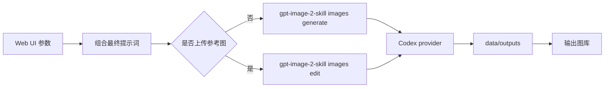

# Codex Imagegen Studio

一个本地运行的参数化生图工作台，把提示词编排、图生图、自动队列、进度展示和输出管理放在同一个页面里。


## Highlights

- **Codex 额度生图**：通过 [`gpt-image-2-skill`](https://github.com/Wangnov/gpt-image-2-skill) 的 `provider=codex` 调用本机 Codex 登录态。
- **文生图 / 图生图**：上传 PNG、JPG 或 WebP 后自动切换到 `images edit` 流程。
- **自动队列**：点击「加入自动队列」后，本地后端会串行调用 Codex 生图，不需要再手动复制请求给 Codex。
- **实时进度**：流式显示任务阶段、百分比和生成日志。
- **参数说明书**：页面内置说明书，解释尺寸、质量、压缩、背景、变体等选项。
- **输出管理**：生成图自动保存到 `data/outputs/`，页面支持打开、保存、删除。
- **API 备用模式**：设置 `OPENAI_API_KEY` 后可直接走 OpenAI Images API。

## Preview

```text
┌──────────────────────── Codex Imagegen Studio ────────────────────────┐
│ 输入 / 参考图          核心参数                  细化项                │
│ 主提示词              用途、风格、尺寸、质量      主体、构图、镜头等      │
├───────────────────────────────────────────────────────────────────────┤
│ 最终提示词             进度 + 自动队列             输出图库             │
└───────────────────────────────────────────────────────────────────────┘
```

## Requirements

- Node.js 20+
- 已登录的 Codex 本机状态：`~/.codex/auth.json`，或设置了 `CODEX_HOME/auth.json`
- Windows、macOS、Linux 均可运行；本项目在 Windows + PowerShell 下开发和验证

> Codex provider 依赖社区工具和 Codex/ChatGPT 私有后端行为，不是 OpenAI 官方公开 Images API。后续能力可能受账号状态、后端变化或工具版本影响。

## Quick Start

```powershell
git clone https://github.com/lhzyyds666/codex-imagegen-platform.git
cd codex-imagegen-platform
npm install
npm start
```

打开：

```text
http://localhost:4937
```

## Optional: OpenAI API Mode

如果你想启用「API 生成」按钮：

```powershell
$env:OPENAI_API_KEY="sk-..."
npm start
```

没有设置 `OPENAI_API_KEY` 时，API 按钮会自动禁用，Codex 生成和自动队列仍可使用。

## How It Works

页面会把你填写的参数合成为一段完整提示词，然后交给后端执行：



自动队列是内存队列：服务重启后队列历史会清空，但已经生成的图片仍保留在 `data/outputs/`。

## Parameters

| 参数 | 用途 |
| --- | --- |
| 主提示词 | 描述真正想要的画面。建议写主体、动作、场景和用途。 |
| 参考图 / 图生图 | 上传后自动走编辑流程，适合重绘、换风格、保留构图。 |
| 用途 | 告诉平台图像最终用途，比如产品图、论文图、Logo、信息图。 |
| 风格 | 控制整体视觉方向，比如电影感、写实、动漫、商业产品。 |
| 比例 | 先声明画面方向，比如 `16:9` 横屏、`9:16` 竖屏或 `1:1` 方图。 |
| 尺寸 | `auto` 让模型选择；固定尺寸会影响像素、比例和清晰度，包含 `2160x3840` 4K 竖屏。 |
| 质量 | `auto` 自动判断；`high` 更精细但更慢。 |
| 格式 | PNG 适合清晰图和文字，JPEG 适合照片，WebP 文件更小。 |
| 变体 | 一次生成几张候选图，数量越多等待越久。 |
| 压缩 | 主要影响 JPEG/WebP 文件体积和画质。 |
| 默认 / auto / opaque | 背景策略：不指定、自动决定、强制不透明。 |
| 透明背景 | 要求生成可抠图或透明背景倾向的图。 |
| 不要出现 | 负面约束，比如水印、低清、杂乱背景、变形手。 |

## Project Layout

```text
.
├─ public/
│  ├─ index.html
│  ├─ app.js
│  └─ styles.css
├─ data/
│  ├─ outputs/      # generated images, ignored by git
│  ├─ uploads/      # reference image cache, ignored by git
│  └─ requests/     # legacy/request records, ignored by git
├─ server.mjs
├─ package.json
└─ README.md
```

## Useful Commands

```powershell
npm start
node --check server.mjs
node --check public/app.js
```

## Notes

- `node_modules/`、生成图、上传图、请求记录、`.env` 和本地 `QA_Log.md` 都不会提交到 GitHub。
- 生成图片默认只保存在本机项目目录，不会自动上传。
- 仓库未附带开源许可证；如需复用，请先自行确认授权边界。
